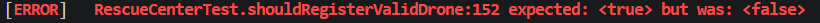
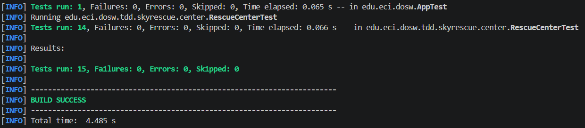

# DOSW_LAB5_FLR

## Integrantes
- Juan Esteban Laverde
- Juan José Rivera Lopez
- Brian Steven Fierro

El sistema de skyrescue lo que busca resolver es atender diferentes solicitudes de emergencia a través de un sistema donde procesa estas peticiones asignando drones y operarios que puedan atender el lugar donde se le necesita, el RescueCenter es el encargado de recibir y manejar estas solicitudes, ya que es el que contiene a los operarios que existen y se pueden utilizar, junto con los drones y sus especificaciones. Lo que se tiene en cuenta al asignar misiones nuevas es que los funcionarios y drones que se piden utilizar no estén ya en una misión, y que el dron tenga las especificaciones necesarias para poder llegar y atender la emergencia.
Las operaciones que desarrollamos con TDD fueron: Agregar drones al centro de rescate, asignar misiones y completar una misione en curso.

### Ciclo TDD - creación de dron
**RED:** prueba que demuestra que se agrega un dron correctamente al centro.

**GREEN:** implementación mínima que hace pasar la prueba.

**REFACTOR:** Para el refactor sólo se juntaron las diferentes condiciones de negocio en un if.

### Cobertura con Jacoco
Cobertura incial:

CObertura final:

### Dashboard de SonarQube
Dashboard:

## Pull Requests
- PR JUnit: #1[PRJunit](https://github.com/BrianFierro03/DOSW_LAB5_FLR/pull/1)
- PR Clases Bases: #2[Clases](https://github.com/BrianFierro03/DOSW_LAB5_FLR/pull/2)
- PR TDD addDrone: #3[addDrone](https://github.com/BrianFierro03/DOSW_LAB5_FLR/pull/5)
- PR TDD assignMission: #4[assignMission](https://github.com/BrianFierro03/DOSW_LAB5_FLR/pull/6)
- PR TDD completeMission: #5[completeMission](https://github.com/BrianFierro03/DOSW_LAB5_FLR/pull/7)
- PR JaCoCo: #6[Jacoco](https://github.com/BrianFierro03/DOSW_LAB5_FLR/pull/9)
- PR SonarQube: #7[SonarQube](https://github.com/BrianFierro03/DOSW_LAB5_FLR/pull/10)

## Reflexión ténica
1. Nos permitió reconocer problemas con la creación y uso de los drones.
2. Se tuvo que cambiar el uso de los streams en un método y la mejora de un ciclo ineficiente.
3. Descubrimos que nos faltó algo de cobertura, esto se debió a que no se utilizaban por completo todos los métodos disponibles, los cuales en su mayoría eran getters y setters.
4. Encontramos problemas con la extensión de nuestro código y nos permitió ver partes que no se utilizan del código pero sin embargo estos no eran muy importantes, por lo que no hubo un cambio significativo en nuestro código.